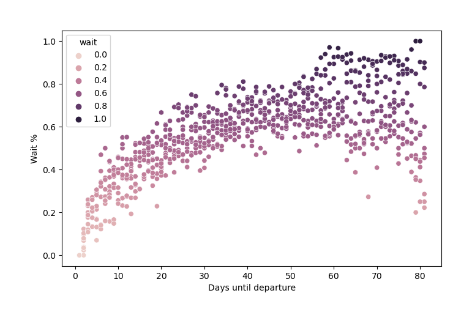
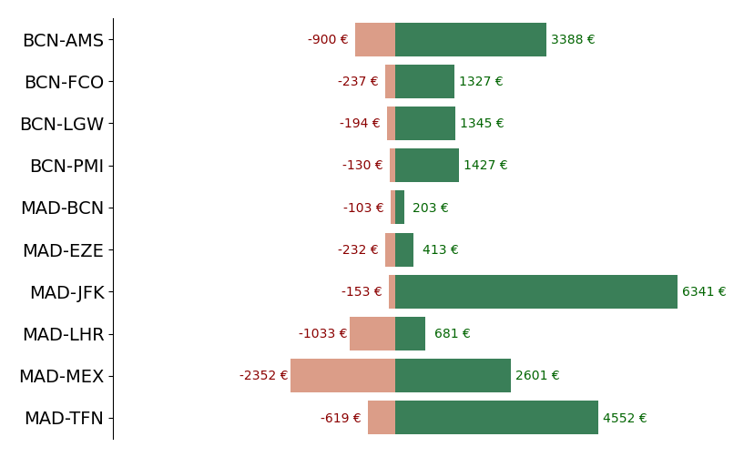

# Flight Prices Prediction to Determine the Right Time to Buy Airline Tickets


## Objective
The price of a flight varies greatly over the months leading up to the departure day. These fluctuations are due to many factors; supply/demand, 
airline offers, remaining days before the flight departs, etc... 
\
\
In this project the objective is to try to model these fluctuations in order to create a predictor that is able to indicate if the flight price 
will go down in the future and how many days the traveler should wait to get the best price. 

## Instructions 
First, clone the repository and go into the folder:
```
git clone https://github.com/adriancervero/flight-prices-prediction.git
cd flight-prices-prediction
```
Next, create the environment with the necessary dependencies:
```
conda env create --file environment.yml
```
Finally, execute make command for reproduce all the analysis
```
make all
```
Results are stored in [/reports](/reports)
\
Model is in [/models](/models)
\
\
To launch the front-end, you can insert the following command:
```
streamlit run app.py
```
\
The whole process can also be replicated by following the jupyter notebooks available in [/notebooks](/notebooks)
## Data collection
Historical flight prices are not directly available on the internet. Therefore the only option is to use some resources and collect data over a period of time.
For this purpose I used the [Kiwi](https://www.kiwi.com/en/) API. I extracted flight data from 10 routes (with spanish origins) daily for almost 3 months. The API documentation is available [here](https://docs.kiwi.com/).
\
To make the requests to the API I have used the Python module 'requests'. The features extracted from the JSON response were the following:
- Price
- Origin
- Destination
- Fly duration
- Distance
- Airlines
- Flight No
- Seats
- Departure and Arrival Time
- Departure day
- Collection day
\
\
The script used for all this process is available in [/src/scripts/collect_data.py](/src/scripts/collect_data.py)

## Model
For the construction of the model, the data were first separated into training, validation and test. We grouped the training flights according to some flight features (airline, time of departure...) and the days remaining until the departure day. Then, we labeled the groups according to whether the price drops in later days.
\
\
The two most determinant features to predict this trend have been the days until the departure day of the flight and a feature that we have created that represents the probability that a price will go down.This feature is calculated by grouping again the groups of flights that belong to the same route and computing the percentage of flights that are labeled with wait in each of these new groups. 
\
\
In the following graph we can see this feature 'prob' is related to the days remaining until the departure of the flight.

\
Each dot represents a flights group (Grouped by route and days until departure)
\
\
As our goal is to save as much money as possible. The metric used to evaluate the models is the money saved by travelers. For this reason we have also taken precision into account as we have decided to minimize false positives as they end up being the main source of money losses.
\
In general, the model that has given us the best results is a Random Forest, so this has finally been chosen for the final product.

## Results
| Metric | RandomForest | LogisticRegression | XGBoost | KNN |
| ------ | ------------- | ------------------ | -------| ----- |
| Precision (valid) | 0.77  | 0.68 | 0.66 | 0.67 |
| Savings* (valid)  | 11%  | 7% | 5% | 6% |
| Precision (test) | 0.74 | 0.69 | 0.64 | 0.69 |
| Savings (test) | 10% | 6% | 4% | 5% |

 .* Savings are the average percentage money saved by traveler
 
 ### Savings and losses by route:
 
 
